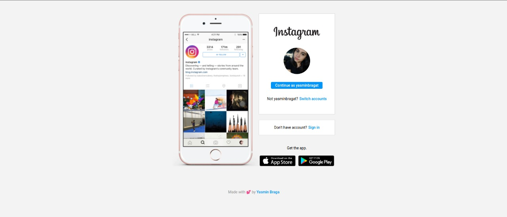

# Clone do Instagram

Oie! Essa foi minha solução para o desafio proposto pelo curso da [Dio](https://www.dio.me/) sobre CSS e flexbox que tem como proposta construir a página inicial do instagram.

## Conteúdos

- [Visão Geral](#overview)
  - [O desafio](#the-challenge)
  - [Screenshot](#screenshot)
- [Meu processo](#my-process)
  - [O que foi utilizado](#built-with)
  - [O que eu aprendi](#what-i-learned)
- [Me encontre](#author)

## Visão Geral

### O desafio

Usuários podem:

- Visualizar a página de login do instagram em dispositivos mobile e desktops.

### Screenshot

## Meu processo

### O que foi utilizado

- Semantic HTML5 markup
- CSS custom properties
- Flexbox
- Mobile-first workflow

### O que eu aprendi

Nesse projeto foi feito a página inicial do instagram de forma responsiva, utilizando o método de mobile first. Além disso, foi aplicado HTML semântico e propriedades de CSS, principalmente flexbox.

## Me encontre

- Frontend Mentor - [@yasminbraga](https://www.frontendmentor.io/profile/yasminbraga)
- Instagram - [@yasminbragat](https://www.instagram.com/yasminbragat/)

Made with :purple_heart: by [Yasmin Braga](https://github.com/yasminbraga/)
